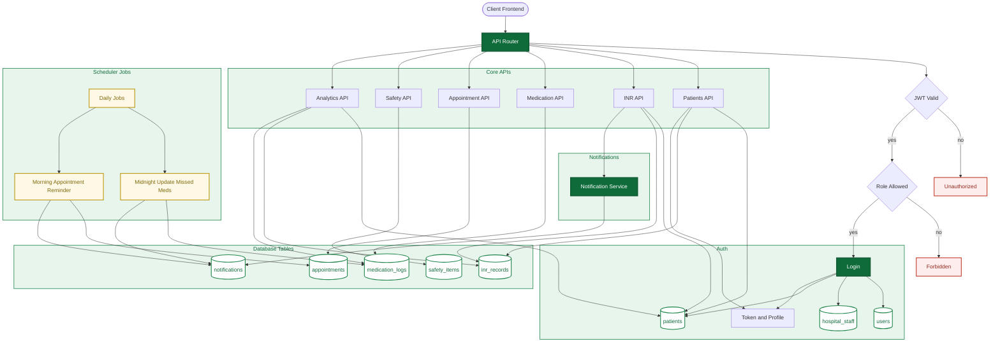

# Wafarin-Care-backend
Backend API for a hospital-grade Warfarin management platform—INR tracking, dose adjustment workflows, and secure provider–patient messaging with role-based access and audit logging.
## System Flow (Backend) – Styled

